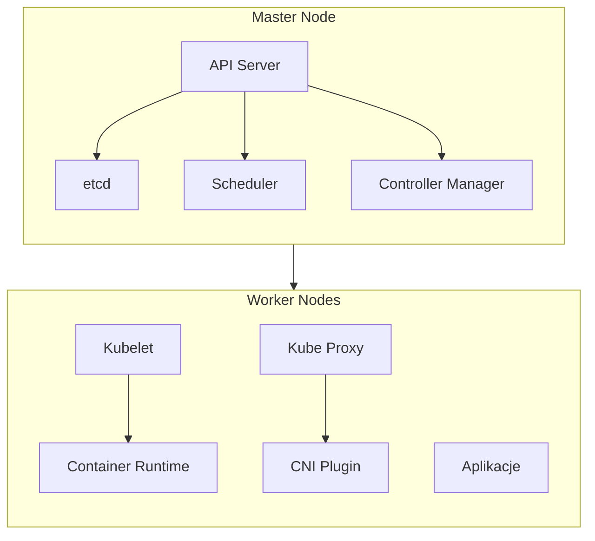

# Klaster Kubernetes - Przewodnik wdrożenia

## Wymagania systemowe

### Master Node
- CPU: 2+ rdzenie
- RAM: 2GB+
- Dysk: 50GB+
- OS: Ubuntu 24.04 LTS

### Worker Node
- CPU: 1+ rdzeń
- RAM: 1GB+
- Dysk: zależnie od aplikacji
- OS: Ubuntu 24.04 LTS

## Konfiguracja SSH

1. Wygeneruj klucz SSH:
```bash
ssh-keygen -t rsa -b 4096
```

2. Kopiuj klucz na serwery:
```bash
ssh-copy-id -f -i ~/.ssh/id_rsa.pub -o PubkeyAuthentication=no root@<IP_SERWERA>
```

3. W razie problemów z SSH:
```bash
# Wyczyść stare klucze
ssh-keygen -R <IP_SERWERA>

# Dodaj konfigurację
cat >> ~/.ssh/config << EOF
Host <IP_SERWERA>
    IdentitiesOnly yes
    IdentityFile ~/.ssh/id_rsa
EOF
```

## Wdrożenie klastra

### 1. Inicjalizacja klastra
```bash
chmod +x setup-cluster.sh
./setup-cluster.sh <MASTER_IP> <WORKER_IP>
```

Skrypt:
- Instaluje containerd i Kubernetes
- Konfiguruje sieć Flannel
- Inicjalizuje master node
- Dołącza worker node
- Tworzy logi w cluster_setup.log

### 2. Wdrożenie aplikacji
```bash
chmod +x deploy-app.sh
./deploy-app.sh <MASTER_IP>
```

Skrypt:
- Generuje certyfikaty SSL
- Tworzy Secret TLS
- Wdraża Nginx (2 repliki)
- Konfiguruje LoadBalancer
- Ustawia Ingress HTTPS
- Tworzy logi w app_deployment.log

### 3. Testowanie
```bash
chmod +x test-app.sh
./test-app.sh <MASTER_IP>
```

Skrypt testuje:
- Stan klastra i node'ów
- Storage i networking
- DNS i service discovery
- Komponenty systemowe
- Dostępność aplikacji
- Logi systemowe
- Tworzy logi w app_testing.log

## Architektura



## Rozwiązywanie problemów

1. Node NotReady:
```bash
# Sprawdź CNI
kubectl get pods -n kube-system
kubectl logs -n kube-system -l k8s-app=kube-dns

# Sprawdź logi
journalctl -u kubelet
```

2. Pody Pending:
```bash
# Sprawdź tainty
kubectl describe node <NODE_NAME> | grep Taint

# Sprawdź logi schedulera
kubectl logs -n kube-system kube-scheduler-*
```

3. Problemy sieciowe:
```bash
# Sprawdź CNI
ls /etc/cni/net.d/
crictl info | grep network

# Sprawdź połączenia
netstat -tulpn
```


### 1. Test konfiguracji klastra
```bash
./setup-cluster.sh <MASTER_IP> <WORKER_IP>
```
Walidacja:
- Status node'ów: `kubectl get nodes`
- Komponenty systemowe: `kubectl get pods -n kube-system`
- Networking CNI: `kubectl get pods -n kube-flannel`

Kryteria akceptacji:
- [ ] Wszystkie node'y w stanie Ready
- [ ] CoreDNS działa
- [ ] Flannel CNI aktywny

### 2. Test aplikacji
```bash
./deploy-app.sh <MASTER_IP>
```
Walidacja:
- Deployment: `kubectl get deployments`
- Pody: `kubectl get pods`
- Serwis: `kubectl get svc`
- Ingress: `kubectl get ingress`

Kryteria akceptacji:
- [ ] Deployment ma 2 repliki
- [ ] Wszystkie pody Running
- [ ] LoadBalancer ma zewnętrzne IP
- [ ] HTTPS działa

### 3. Test wdrożenia z Git
```bash
./deploy-git.sh <MASTER_IP> <GIT_URL>
```
Walidacja:
- Pliki konfiguracyjne: `ls -la k8s-temp/*.yaml`
- Status wdrożenia: `kubectl get all -n example`

Kryteria akceptacji:
- [ ] Repo zostało sklonowane
- [ ] Wszystkie pliki YAML zaaplikowane
- [ ] Zasoby działają w namespace example

## Diagnostyka błędów

### Network Plugin Not Ready
```bash
# Sprawdź CNI
ls /etc/cni/net.d/
kubectl logs -n kube-system -l k8s-app=flannel
```

### Pody w stanie Pending
```bash
# Sprawdź tainty
kubectl describe nodes | grep Taint
kubectl describe pod <POD_NAME>
```

### LoadBalancer Pending
```bash
# Sprawdź serwis
kubectl describe service <SERVICE_NAME>
# Sprawdź eventy
kubectl get events --sort-by=.metadata.creationTimestamp
```

## Logi systemowe
```bash
# Kubelet
journalctl -u kubelet

# Containerd
journalctl -u containerd

# API Server
kubectl logs -n kube-system kube-apiserver-*
```

## Monitorowanie

### Zasoby
```bash
kubectl top nodes
kubectl top pods
```

### Stan klastra
```bash
kubectl get componentstatuses
kubectl get events --all-namespaces
```

### Networking
```bash
kubectl get endpoints
netstat -tulpn
```


## Cluster tools


```bash
#!/bin/bash
set -e
LOG_FILE="cluster_tools.log"

log() {
    echo "[$(date '+%Y-%m-%d %H:%M:%S')] $1" | tee -a $LOG_FILE
}

if [ "$#" -ne 2 ]; then
    echo "Użycie: $0 <IP_SERWERA> <DOMENA_BAZOWA>"
    exit 1
fi

SERVER_IP=$1
BASE_DOMAIN=$2

ssh -t root@$SERVER_IP "
    set -x
    export KUBECONFIG=/root/.kube/config

    # Instalacja narzędzi diagnostycznych
    apt-get update && apt-get install -y \
        tcpdump \
        net-tools \
        iptables-persistent \
        nmap \
        netcat \
        dnsutils \
        telnet \
        ethtool

    # Instalacja Velero dla backupów
    helm repo add vmware-tanzu https://vmware-tanzu.github.io/helm-charts
    helm install velero vmware-tanzu/velero \
        --namespace velero \
        --create-namespace \
        --set configuration.provider=aws

    # Instalacja EFK Stack
    helm repo add elastic https://helm.elastic.co
    
    helm install elasticsearch elastic/elasticsearch \
        --namespace logging \
        --create-namespace \
        --set replicas=1

    helm install kibana elastic/kibana \
        --namespace logging

    helm install filebeat elastic/filebeat \
        --namespace logging
        
    # Konfiguracja Ingress dla Kibana
    cat << EOF | kubectl apply -f -
apiVersion: networking.k8s.io/v1
kind: Ingress
metadata:
  name: kibana-ingress
  namespace: logging
  annotations:
    cert-manager.io/cluster-issuer: letsencrypt-prod
spec:
  ingressClassName: nginx
  tls:
  - hosts:
    - kibana.${BASE_DOMAIN}
    secretName: kibana-tls
  rules:
  - host: kibana.${BASE_DOMAIN}
    http:
      paths:
      - path: /
        pathType: Prefix
        backend:
          service:
            name: kibana-kibana
            port:
              number: 5601
EOF

    # Instalacja narzędzi administracyjnych
    kubectl apply -f https://raw.githubusercontent.com/ahmetb/kubectx/master/kubens
    kubectl apply -f https://raw.githubusercontent.com/ahmetb/kubectx/master/kubectx
    
    # Konfiguracja polityk sieciowych
    cat << EOF | kubectl apply -f -
apiVersion: networking.k8s.io/v1
kind: NetworkPolicy
metadata:
  name: default-deny-all
  namespace: default
spec:
  podSelector: {}
  policyTypes:
  - Ingress
  - Egress
EOF

    # Instalacja narzędzi monitorowania wydajności
    cat << EOF | kubectl apply -f -
apiVersion: v1
kind: ServiceAccount
metadata:
  name: node-problem-detector
  namespace: default
---
apiVersion: rbac.authorization.k8s.io/v1
kind: ClusterRoleBinding
metadata:
  name: node-problem-detector
roleRef:
  apiGroup: rbac.authorization.k8s.io
  kind: ClusterRole
  name: system:node-problem-detector
subjects:
- kind: ServiceAccount
  name: node-problem-detector
  namespace: default
---
apiVersion: apps/v1
kind: DaemonSet
metadata:
  name: node-problem-detector
  namespace: default
spec:
  selector:
    matchLabels:
      name: node-problem-detector
  template:
    metadata:
      labels:
        name: node-problem-detector
    spec:
      containers:
      - name: node-problem-detector
        image: k8s.gcr.io/node-problem-detector/node-problem-detector:v0.8.7
        securityContext:
          privileged: true
        env:
        - name: NODE_NAME
          valueFrom:
            fieldRef:
              fieldPath: spec.nodeName
        volumeMounts:
        - name: log
          mountPath: /var/log
        - name: kmsg
          mountPath: /dev/kmsg
          readOnly: true
      serviceAccountName: node-problem-detector
      volumes:
      - name: log
        hostPath:
          path: /var/log/
      - name: kmsg
        hostPath:
          path: /dev/kmsg
EOF

    # Ustawienie automatycznych backupów
    cat << EOF | kubectl apply -f -
apiVersion: velero.io/v1
kind: Schedule
metadata:
  name: daily-backup
  namespace: velero
spec:
  schedule: \"0 1 * * *\"
  template:
    includedNamespaces:
    - default
    - monitoring
    - logging
    ttl: 720h
EOF

    echo \"Dodatkowe usługi dostępne pod adresami:\"
    echo \"- Kibana: https://kibana.${BASE_DOMAIN}\"
"

log "Konfiguracja dodatkowych narzędzi zakończona dla domeny ${BASE_DOMAIN}"

```

[cluster_tools.sh](cluster_tools.sh)

```bash
./cluster_tools.sh IP DOMENA
```

Skrypt dodaje:

1. Narzędzia diagnostyczne i monitorowania
2. EFK Stack (Elasticsearch, Fluentd, Kibana)
3. Velero dla backupów
4. Network Policies
5. Node Problem Detector
6. Automatyczne backupy
   