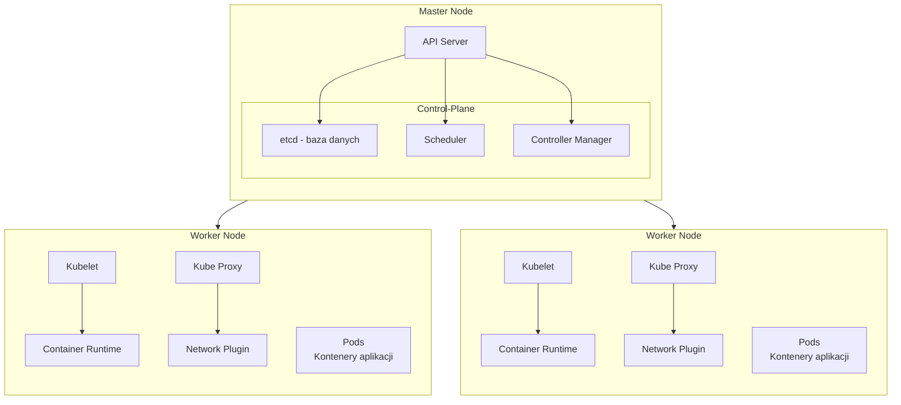

# kubernetes


```bash
#!/bin/bash
# setup-ssh.sh
# Skrypt do konfiguracji dostępu SSH

set -e
LOG_FILE="ssh_setup.log"

log() {
    echo "[$(date '+%Y-%m-%d %H:%M:%S')] $1" | tee -a $LOG_FILE
}

if [ "$#" -ne 2 ]; then
    echo "Użycie: $0 <REMOTE_USER> <REMOTE_IP>"
    exit 1
fi

REMOTE_USER=$1
REMOTE_IP=$2

# Sprawdź czy klucz SSH istnieje
if [ ! -f ~/.ssh/id_rsa ]; then
    log "Generuję nową parę kluczy SSH..."
    ssh-keygen -t rsa -b 4096 -f ~/.ssh/id_rsa -N ""
fi

# Sprawdź połączenie SSH
log "Sprawdzam połączenie z serwerem..."
if ! nc -z -w5 $REMOTE_IP 22; then
    log "BŁĄD: Port 22 jest niedostępny na $REMOTE_IP"
    exit 1
fi

# Kopiuj klucz SSH
log "Kopiuję klucz publiczny na serwer..."
if ! ssh-copy-id -i ~/.ssh/id_rsa.pub "$REMOTE_USER@$REMOTE_IP"; then
    log "BŁĄD: Nie udało się skopiować klucza"
    exit 1
fi

# Test połączenia
log "Testuję połączenie SSH..."
if ssh -o BatchMode=yes -o ConnectTimeout=5 "$REMOTE_USER@$REMOTE_IP" echo "Test połączenia OK"; then
    log "Konfiguracja SSH zakończona sukcesem"
else
    log "BŁĄD: Test połączenia nie powiódł się"
    exit 1
fi

```

Użycie skryptu:
```bash
./setup-ssh.sh username 192.168.1.100
```

ssh-copy-id -i ~/.ssh/id_rsa.pub username@192.168.1.100

ssh-copy-id -i ~/.ssh/id_rsa.pub -o PubkeyAuthentication=no użytkownik@host

Skrypt:
1. Generuje klucze SSH jeśli nie istnieją
2. Sprawdza dostępność portu SSH
3. Kopiuje klucz publiczny na serwer
4. Testuje połączenie
5. Zapisuje logi operacji
 
## Start

1. `setup-cluster.sh` - konfiguruje klaster Kubernetes:
- Przyjmuje dwa parametry: IP master node i worker node
- Instaluje wszystkie wymagane komponenty na obu serwerach
- Konfiguruje master node z siecią Flannel
- Automatycznie dołącza worker node do klastra
- Zapisuje logi do pliku cluster_setup.log

2. `deploy-app.sh` - wdraża przykładową aplikację:
- Generuje certyfikat SSL
- Tworzy Secret z certyfikatem
- Wdraża aplikację nginx z 2 replikami
- Konfiguruje Service typu LoadBalancer
- Ustawia Ingress z HTTPS
- Zapisuje logi do pliku app_deployment.log

3. `test-app.sh` - testuje wdrożoną aplikację:
- Sprawdza status podów
- Weryfikuje konfigurację serwisu i Ingress
- Testuje połączenie HTTPS
- Sprawdza logi aplikacji
- Zapisuje wyniki do pliku app_testing.log

```bash
chmod +x *.sh
```

1. Najpierw uruchom setup-cluster.sh z IP serwerów:
```bash
./setup-cluster.sh 192.168.1.10 192.168.1.11
```

2. Po utworzeniu klastra wdróż aplikację:
```bash
./deploy-app.sh
```

3. Na końcu przetestuj aplikację:
```bash
./test-app.sh
```

Każdy skrypt zapisuje szczegółowe logi do osobnego pliku, co pozwala na monitorowanie procesu i debugowanie w razie problemów.


Wyjaśnię kluczowe różnice między node'ami master i worker w klastrze Kubernetes:




## Informacje 

1. Master Node (Control Plane):
    - Jest "mózgiem" klastra
    - Zawiera kluczowe komponenty:
        * API Server - główny punkt komunikacji w klastrze
        * etcd - baza danych przechowująca stan klastra
        * Scheduler - decyduje gdzie umieścić pody
        * Controller Manager - zarządza kontrolerami klastra
    - Nie uruchamia zazwyczaj aplikacji produkcyjnych
    - Wymaga więcej RAM i CPU do zarządzania klastrem
    - Zwykle zabezpieczony przed dostępem z zewnątrz

2. Worker Node:
    - Jest "pracownikiem" wykonującym zadania
    - Zawiera komponenty wykonawcze:
        * Kubelet - agent zarządzający kontenerami
        * Container Runtime (np. Docker) - uruchamia kontenery
        * Kube Proxy - zarządza siecią między podami
    - Uruchamia pody z aplikacjami
    - Może mieć różne konfiguracje sprzętowe
    - Może być dodawany i usuwany z klastra dynamicznie

Przykładowe różnice w wymaganiach sprzętowych:

```
Master Node:
- CPU: minimum 2 rdzenie
- RAM: minimum 2GB
- Dysk: minimum 50GB

Worker Node:
- CPU: minimum 1 rdzeń
- RAM: minimum 1GB
- Dysk: zależnie od aplikacji
```

W praktyce:
- Master node powinien być bardziej niezawodny i stabilny
- Worker nodes mogą być dodawane/usuwane w zależności od obciążenia
- Dla wysokiej dostępności często stosuje się kilka master nodes
- Worker nodes mogą być różnej wielkości i mieć różne zasoby

Przykład ruchu w klastrze:
1. Użytkownik wysyła żądanie do API Server na master node
2. API Server weryfikuje żądanie
3. Scheduler decyduje, który worker node otrzyma zadanie
4. Worker node poprzez kubelet uruchamia odpowiednie kontenery
5. Aplikacja działa na worker node, podczas gdy master node monitoruje jej stan

W kontekście wcześniej utworzonych skryptów:
- Na master node instalujemy dodatkowe komponenty (kubectl)
- Worker node otrzymuje tylko niezbędne komponenty do uruchamiania kontenerów
- Master inicjuje klaster (kubeadm init)
- Worker dołącza do istniejącego klastra (kubeadm join)


## Help


Problem ten występuje, gdy jest zbyt wiele nieudanych prób logowania. Oto rozwiązanie:

1. Wyczyść zapisane klucze:
```bash
ssh-keygen -R nazwa_hosta_lub_ip
```

2. Wymuś użycie konkretnego klucza:
```bash
ssh-copy-id -i ~/.ssh/id_rsa.pub -o PubkeyAuthentication=no użytkownik@host
```

3. Jeśli nadal występuje błąd, dodaj do .ssh/config:
```
Host nazwa_hosta_lub_ip
    IdentitiesOnly yes
    IdentityFile ~/.ssh/id_rsa
```

Alternatywnie, możesz użyć:
```bash
ssh-copy-id -f -i ~/.ssh/id_rsa.pub użytkownik@host
```

Flaga `-f` wymusza kopiowanie klucza, ignorując wcześniejsze błędy.